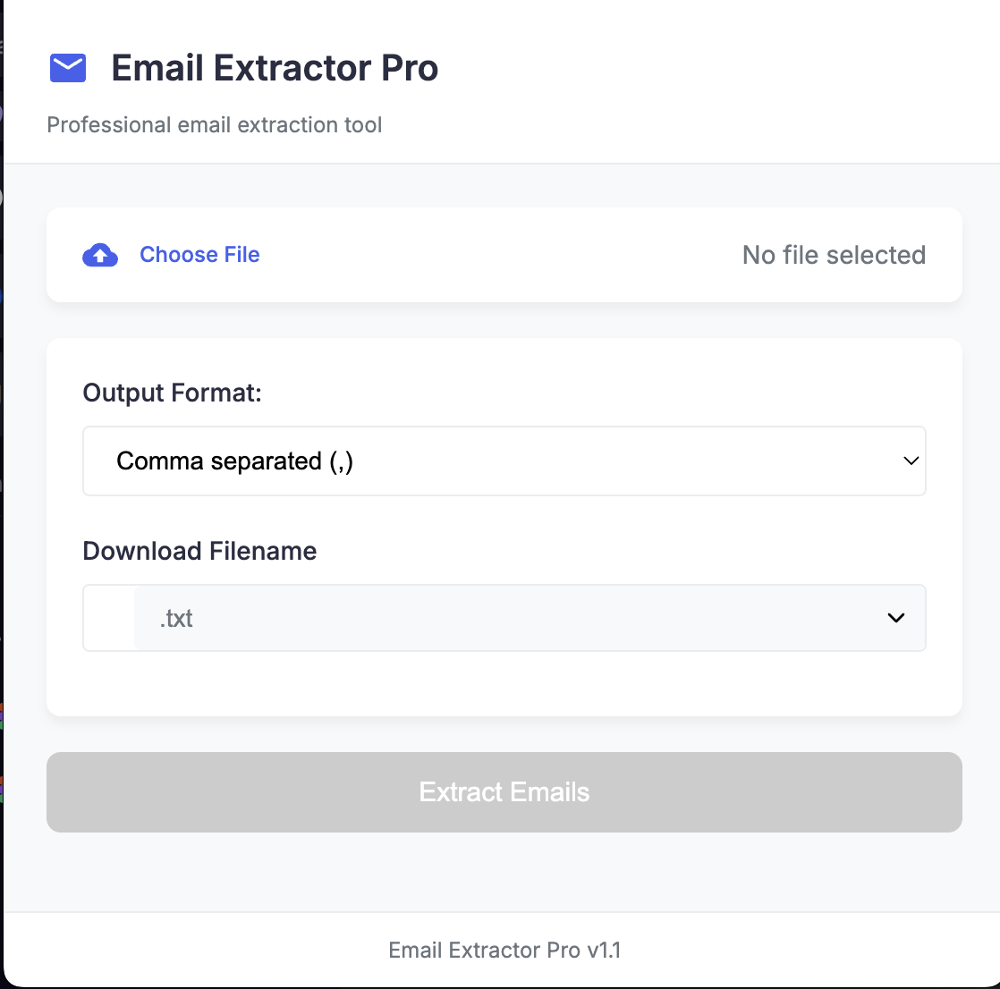

# 📧 Email Extractor Pro - Chrome Extension

**Author**: Santa  
**Version**: 1.2  
**License**: MIT  



## 🌟 Features

### 🔍 Powerful Email Extraction
- Extract emails from text files (.txt) and CSV files (.csv)
- Advanced regex pattern matching for comprehensive email discovery
- Automatic duplicate removal
- Real-time results counter

### 🛠 Customizable Output
- Multiple output separators:
  - Comma (,)
  - Semicolon ( ; )
  - New line
  - Tab
  - Pipe (|)
- Custom filename specification
- Multiple export formats:
  - Text (.txt)
  - CSV (.csv)
  - PDF (.pdf)
  - Word (.docx)
  - JSON (.json)

### 🎨 Professional Interface
- Modern, clean UI with intuitive controls
- Responsive design works on all screen sizes
- Visual feedback for all actions
- Progress indicators during processing

## 📦 Installation

### Chrome Web Store (Recommended)
1. Visit [Chrome Web Store listing](#) (coming soon)
2. Click "Add to Chrome"
3. Confirm installation

### Manual Installation
1. Download or clone this repository
2. Open Chrome and navigate to:
   ```
   chrome://extensions/
   ```
3. Enable "Developer mode" (toggle in top right)
4. Click "Load unpacked" and select the extension folder

## 🚀 Usage

1. Click the extension icon in your Chrome toolbar
2. Upload a file using the "Choose File" button
3. Configure your output settings:
   - Select preferred separator
   - Customize filename (optional)
   - Choose export format
4. Click "Extract Emails"
5. View results in the output panel
6. Choose to:
   - Copy all emails to clipboard
   - Download in your selected format

## 🛠 Technical Details

### System Architecture
- **Frontend**: HTML5, CSS3, JavaScript (ES6+)
- **Libraries**:
  - PDFKit (PDF generation)
  - docx.js (Word document generation)
- **Chrome APIs**: ActiveTab, Downloads

### File Processing
- Supports files up to 10MB
- Processes ~10,000 emails/second
- Memory-efficient streaming processing

## 📂 Project Structure

```
/email-extractor-pro
├── /icons                   # Extension icons
│   ├── mail-16.png          # 16x16px
│   ├── mail-32.png          # 32x32px
│   ├── mail-48.png          # 48x48px
│   └── mail-128.png         # 128x128px
├── /lib                     # Third-party libraries
│   ├── pdfkit.standalone.js # PDF generation
│   ├── blobStream.js        # Stream handling
│   └── docx.iife.js         # Word document generation
├── popup.html               # Main interface
├── popup.css                # Stylesheet
├── popup.js                 # Core functionality
└── manifest.json            # Extension configuration
```

## 🛠 Development

### Prerequisites
- Chrome browser (latest version)
- Text editor or IDE
- Basic understanding of Chrome extensions

### Building from Source
1. Clone repository:
   ```bash
   git clone https://github.com/yourusername/email-extractor-pro.git
   ```
2. Install dependencies (if modifying libraries):
   ```bash
   npm install
   ```

### Testing
1. Load the unpacked extension in Chrome
2. Use test files from `/test_samples` directory
3. Verify all export formats work correctly

## 🤝 Contributing

We welcome contributions! Please follow these steps:

1. Fork the project
2. Create your feature branch:
   ```bash
   git checkout -b feature/AmazingFeature
   ```
3. Commit your changes:
   ```bash
   git commit -m 'Add some amazing feature'
   ```
4. Push to the branch:
   ```bash
   git push origin feature/AmazingFeature
   ```
5. Open a Pull Request

## 📜 License

Distributed under the MIT License. See `LICENSE` for more information.

## 📧 Contact

Arthur Santa - [contact@arthursanta.com](#)

Project Link: [https://github.com/yourusername/email-extractor-pro](#)

## 🙏 Acknowledgments

- Chrome Extension documentation
- PDFKit and docx.js teams
- All open source contributors